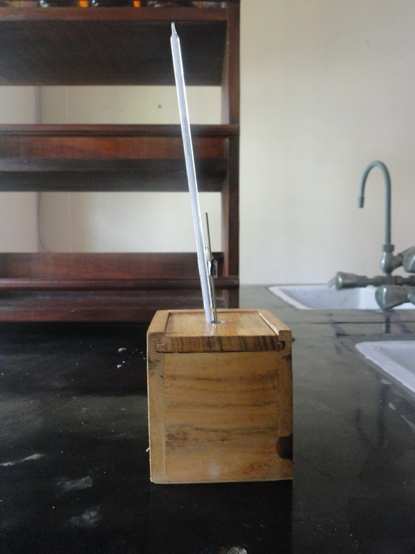
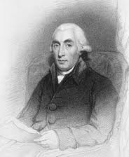
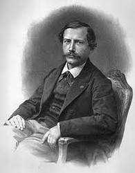
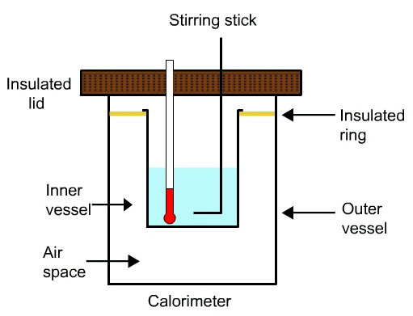
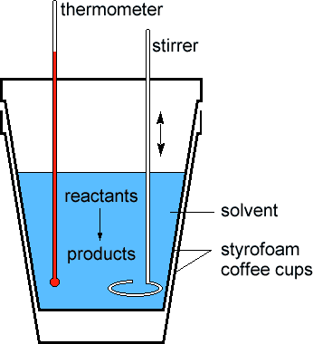
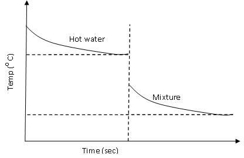

### Introduction:

 

  

 

 
Chemical reactions usually accompany with the formation and absorption of energy in the form of heat. The branch of chemical science dealing with the study of heat and energy changes is known as thermodynamics. The heat changes within a specific system can be studied using the device calorimeter. Calorimetry is derived from the Latin term “calor” which means heat, and the Greek term “metry” means to measure, the heat in the system. The recent advance in the calorimetry and electronics helps the user to maintain the samples under proper conditions that can be easily analysed. The Scottish physician Joseph Black, was the first to recognise the distinction between heat and temperature, and is said to be the “Founder of Calorimetry”. It is noted that the credits for modern techniques of calorimetry is given to French chemist Pierre Eugene Berthelot (1827-1907). He studied the problems associated with the heat measurement and constructed the first modern calorimeter. The terms endothermic and exothermic reactions are also are also invented to describe the heat reactions are also his contributions to chemistry.

 
div style="display: flex; justify-content: center; gap: 20px; flex-wrap: wrap; text-align: center;">

Joseph Black

Pierre Eugene Berthelot

## Theory
Generally the reactions taking place in the chemical sciences are breaking and making of chemical bonds. This is accompanied by some heat effects. Formation of chemical bonds releases energy in the form of heat and hence known as an exothermic reaction. The reaction which is accompanied absorption of heat is known as endothermic reaction. Calorimetry is a scientific term dealing with the changes in energy of the system by measuring the heat exchanged with the surroundings. In a broader sense it is defined to determine the heat released or absorbed in a chemical reaction. A calorimeter is a device designed to measure heat of reaction or physical changes and heat capacity. The device can be sophisticated and expensive or simple and cheap.
 
A calorimeter consists of two vessels, outer vessel and an inner vessel. The space between these vessels acts as a heat insulator and hence there is very little heat exchange in between the inner and outer vessels. Thermometer measures the temperature of the liquid in the inner vessel. The stirrer functions in such a way to stir the liquid to distribute the heat in the entire vessel. The fibre rings in the calorimeter helps to hold the inner vessel hanging in the center of the outer vessel. It also has an insulating cover or lid with holes for attaching the stirring rod and thermometer.

### A brief overview of Calorimetric reactions:

A calorimeter contains water or other substances with known heat capacity. The heat, denoted as $Q$ released by a reaction or process is absorbed by the calorimeter and any substances in the calorimeter. If the only other substance in the calorimeter is water, the following energy balance exists:

$$Q=Q_{cat}+Q_W$$

$Q_{cal}$  = The heat flow for the calorimeter. 
$Q_W$ = The heat flow for the water.

The individual heat flow rate can be directly related to the heat capacity and temperature change for the substance. This can be denoted by the equation

$$Q_{cal}=C_{cal} \Delta T$$

$Q_W = C_W \Delta T$$

$C_{cal}$ = The heat capacity of the calorimeter.
$C_W$ = The heat capacity of the water.

Since the water and calorimeter are in thermal equilibrium they exhibit same $\Delta T$ value.

The heat capacity, which is defined as the amount of heat required to raise the temperature of a given quantity of a substance by one degree Celsius,( unit is J/ 0 C) of the entire system, denoted by $C$ is represented as the sum of the heat capacities for the individual components involved in the reaction process.

$$C=C_{cal}+C_W$$

Note: Since the calorimeter is insulated there is no heat exchange with the surroundings. This can be shown as:

$$Q_{\text{reaction}}=-Q_{\text{calorimeter}}$$

    It is noted that the calorimeter exists as a fixed unit and thus its heat capacity is also thought to be having a fixed value.
    In some cases, where the amount of substance is varying, an intensive measurement of heat capacity, <strong>specific heat capacity</strong>, is employed to study the reactions.
    Specific heat capacity is defined as the heat required for raising unit mass of substance by one degree of temperature.
    It has the units <strong>J/g°C</strong>.
  

  

    The relation between the heat capacity and specific heat of a substance is denoted as:
  

  
<strong>C = m × s</strong>

  <strong>m</strong> = mass of substance in grams 
  <strong>C</strong> = heat capacity 
  <strong>s</strong> = specific heat 

  
The magnitude of these heat effects depends on the following parameters:

  <ol>
    <li>Pressure</li>
    <li>Temperature</li>
    <li>Physical state of the reactants and the products</li>
    <li>Amount of substance involved in the reaction</li>
  </ol>

  

    Depending on the nature of the reactions, different names are given to the heat of reactions, discussed in detail in the following sections.
  

<h3>1. Heat of Formation:</h3>

  It is defined as the amount of heat evolved or absorbed during the formation of one mole of a substance from its component elements.

<h3>2. Heat of Hydration:</h3>

  The formation of a solution involves the interaction of solute with solvent molecules. Many different liquids can be used as solvents to dilute the solute to form liquid solutions. Water is the most commonly used solvent. When water is used as the solvent, the dissolving process is called **hydration**. The enthalpy change associated with the hydration process is called the heat of hydration. Enthalpy of hydration of an ion is the amount of energy released when a mole of the ion dissolves in a large amount of water forming an infinite dilute solution in a specific process.

  Apart from the thermal energies resulting from the chemical reactions, many physical processes including ice melting or vapor condensation are accompanied by the absorption or release of heat. Such physical processes are classified into two types: <strong>Heat of solution</strong> and <strong>Heat of dilution</strong>.

<h3>3. Heat of Solution:</h3>

  The heat of solution or enthalpy of solution is defined as the heat generated or absorbed when a certain amount of the solute dissolves in a certain amount of solvent.

$$NaCl \longrightarrow Na^++Cl^-(aq)$$

<h3>4. Heat of Dilution:</h3>

  It is noted that certain heat effects take place when a solution of a given concentration is diluted to another one. That is, when more solvent is added to lower the overall concentration of the solute in the previously prepared solution, additional heat is given off or absorbed. The heat of dilution is defined as the heat change that is associated with the dilution process. For an infinitely diluted solution, the heat of dilution is noted as zero.

<h3>5. Heat of Combustion:</h3>

  It is the amount of heat evolved when 1 gram molecule of a substance is completely oxidised. That is, the amount of energy released when a given compound undergoes complete combustion with oxygen under standard conditions. The chemical reaction involves hydrocarbons reacting with oxygen to form CO2, H2O, and heat.

<h3>6. Heat of Neutralisation:</h3>

  The heat of neutralisation of an acid is defined as the amount of heat evolved when one equivalent of an acid and one equivalent of a base undergo a neutralisation reaction to form water and a salt. Similarly, the heat of neutralisation of a base is the amount of heat evolved when 1 gram equivalent of the base is completely neutralised by a strong acid in a dilute solution.

$$HA+BOH\longrightleftharpoons AB+H_2O+57.3\text{KJ}$$

$$H^++A^-+B^++OH^- \longrightleftharpoons A^++B^++H_2O+57.3\text{KJ}$$

<h3>Types of Calorimeter:</h3>

<h4>1. Bomb Calorimeter</h4>

  The heat of combustion of a compound is measured by placing a known mass of a compound in a steel container called a constant-volume bomb calorimeter, which is filled with oxygen at about 30 atm pressure. This closed bomb is immersed in a known amount of water. The sample is added in the sample cup and it is electrically ignited. The heat produced by the combustion reaction is calculated by recording the rise in temperature of the water.

<h4>2. Coffee Cup Calorimeter</h4>

  A constant-pressure calorimeter measures the heat effects of a variety of reactions such as neutralisation reactions, heat of solution, and heat of dilutions. 
  A coffee cup calorimeter is basically constructed from a polystyrene (Styrofoam) cup with a lid, in which the cup is filled with a known amount of water 
  and a thermometer inserted measures the heat changes associated with the reaction.

<h4>Determination of Water Equivalent of Calorimeter</h4>

  In a reaction, the quantity of heat that raises the temperature of some substance by some amount, the same quantity of heat can simultaneously raise the same temperature of a certain mass of water. The mass of water is then termed as <strong>water equivalent</strong>.

<h5>Principle:</h5>

  The heat change associated with a chemical reaction can be studied with the help of calorimetric techniques. In a specific reaction, the quantity of heat that raises the temperature of some substance by some amount can simultaneously raise the same temperature of a certain mass of water, assuming the specific heat of water to be 1 calorie per gram. The mass of water is then termed as <strong>water equivalent</strong>.

$$\text{Heat gained by cold water,}(50(T_3-T_2))=\text{Heat lost by the calorimeter,}\left((50+W)(T_1-T_3) \right)$$

<h4>Where,</h4>

$T_1$ = The initial temperature of water and calorimeter. 
$T_2$ = The initial temperature of cold water. 
$T_3$  = The final temperature of the mixture. 
$W$ = The water equivalent of calorimeter. 

<h4>Important steps to follow:</h4>

<ol>
  <li>50 mL water is taken in a beaker and heated to about 60&deg;C.</li>
  <li>Transfer it to a calorimeter fitted with stirrer and thermometer.</li>
  <li>Temperature is noted at every half minute till it becomes constant.</li>
  <li>Add 50 mL of cold water, whose temperature is previously noted, to the calorimeter.</li>
  <li>Note the temperature, in every half minute, till it becomes constant.</li>
  <li>Plot a graph with temperature on Y-axis and time on X-axis (Fig 1).</li>
</ol>

Fig 1. Water Equivalent

